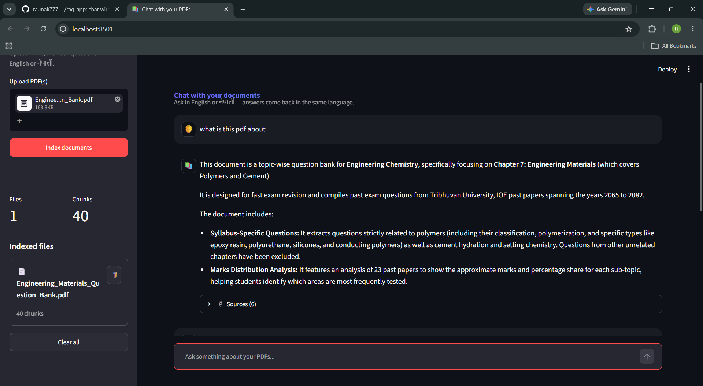

# 📚 PDF Chat — Bilingual RAG App

Chat with your PDFs in **English or नेपाली** and get clear, cited answers — no more skimming through pages of dense documents.

Built as a full Retrieval-Augmented Generation (RAG) pipeline: upload PDFs, ask a question in either language, and get back an answer grounded in your actual documents, with the exact file and page it came from.



## ✨ Features

- 📄 **Multi-PDF upload** — chat across several documents at once
- 🌐 **Bilingual by design** — ask in English or Nepali (नेपाली); the app answers in the same language, even when the source PDF is in the other one
- 📎 **Cited sources** — every answer shows the exact file and page it was pulled from, with a text preview
- 🗂️ **Per-file management** — see chunk counts per file, remove a single document, or clear the whole index
- ⏳ **Rate-limit resilient** — indexing runs in small batches with automatic backoff/retry if the embedding API gets rate-limited, instead of crashing mid-upload
- 💬 **Suggested prompts** — quick-start questions to try as soon as your documents are indexed

## 🧠 How it works

```
PDF Upload
   │
   ▼
Extract Text (pypdf, page-level)
   │
   ▼
Split into Chunks (overlap-aware, Devanagari-aware sentence splitting)
   │
   ▼
Generate Embeddings (Gemini) ── batched with retry on rate limits
   │
   ▼
Store in ChromaDB (persistent, per-file tracked)
   │
   ├─────────────────────────────┐
   │                             │
User Question                Vector Search (top-k similarity)
   │                             │
   └─────────────┬───────────────┘
                 ▼
     Relevant Chunks Retrieved
                 │
                 ▼
   Gemini (answers in the question's language)
                 │
                 ▼
        Final Answer + Cited Sources
```

## 🛠️ Tech Stack

- **Python**
- **LangChain** — orchestration
- **ChromaDB** — vector store (persistent, local)
- **Google Gemini** — embeddings (`gemini-embedding-001`) + chat (`gemini-3.5-flash`)
- **Streamlit** — UI

## 🚀 Setup

**1. Clone and install**

```bash
git clone https://github.com/raunak77711/rag-app.git
cd rag-app
python -m venv venv
venv\Scripts\Activate.ps1      # Windows
# source venv/bin/activate     # Mac/Linux
pip install -r requirements.txt
```

**2. Add your API key**

Create a `.env` file in the project root:

```
PROVIDER=gemini
GOOGLE_API_KEY=your_gemini_key_here
```

Get a free key at [aistudio.google.com/apikey](https://aistudio.google.com/apikey).

**3. Run**

```bash
streamlit run app.py
```

Open the local URL it prints, upload a PDF, click **Index documents**, and start asking questions — in English or नेपाली.

## 📁 Project Structure

```
rag-app/
├── app.py                 # Streamlit UI
├── requirements.txt
├── .env                   # your API key (never committed)
├── .gitignore
├── db/                    # ChromaDB persistent vector store
└── utils/
    ├── loader.py          # PDF → page-level text extraction
    ├── splitter.py        # chunking (Devanagari-aware)
    ├── embedding.py        # Gemini embedding + chat model setup
    └── rag.py             # indexing, retrieval, batched embedding w/ retry, answer generation
```

## 💡 Example

> **You:** यी कागजातहरूको मुख्य बुँदा के हो?
>
> **App:** यस कागजातले... *(answers in Nepali, grounded in the source PDF)*
>
> **📎 Sources:** research.pdf — page 13

## 🔭 Possible extensions

- Swap top-k similarity search for **MMR** or a dedicated reranker
- Add conversational memory so follow-up questions carry context
- OCR support for scanned/image-based PDFs
- Deploy on Streamlit Community Cloud for a shareable live link
